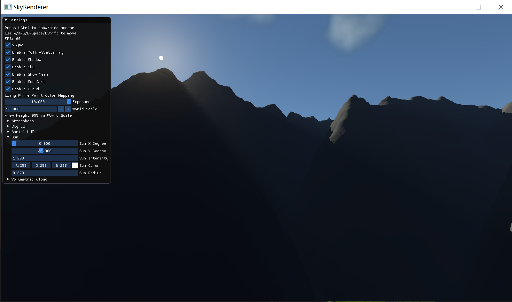

# Sky Renderer
OpenGL implementation of [A Scalable and Production Ready Sky and Atmosphere Rendering Technique](https://sebh.github.io/publications/egsr2020.pdf)
and [Real-time rendering of volumetric clouds](https://www.diva-portal.org/smash/get/diva2:1223894/FULLTEXT01.pdf)

## ScreeShot

